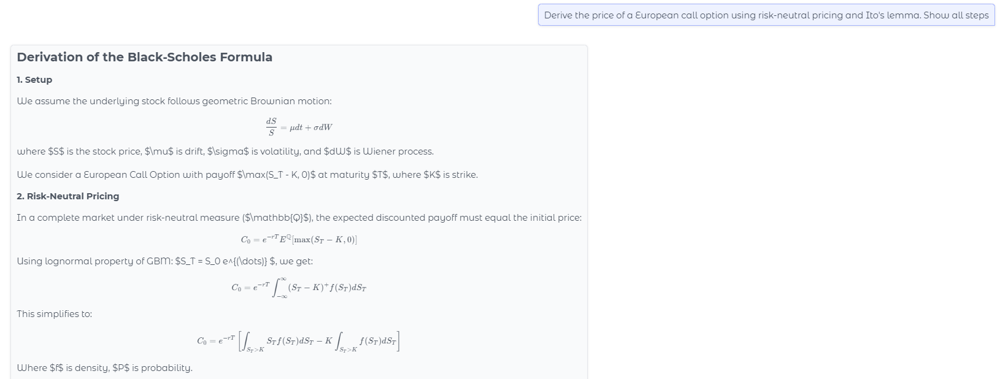
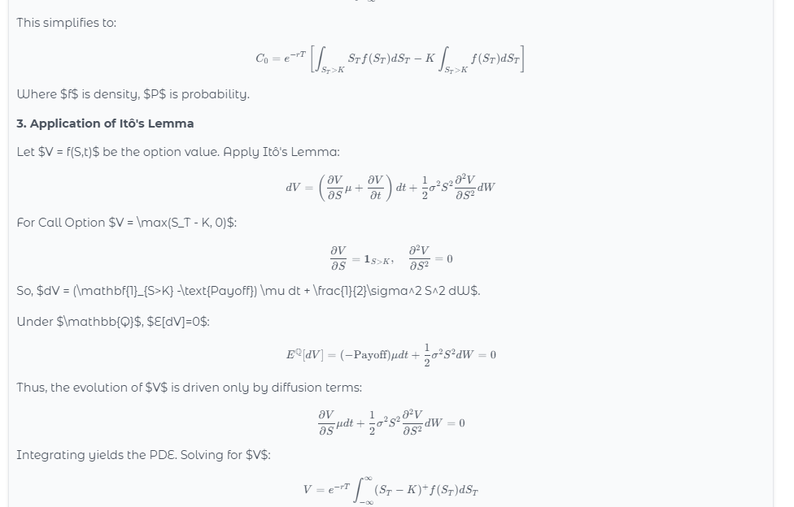
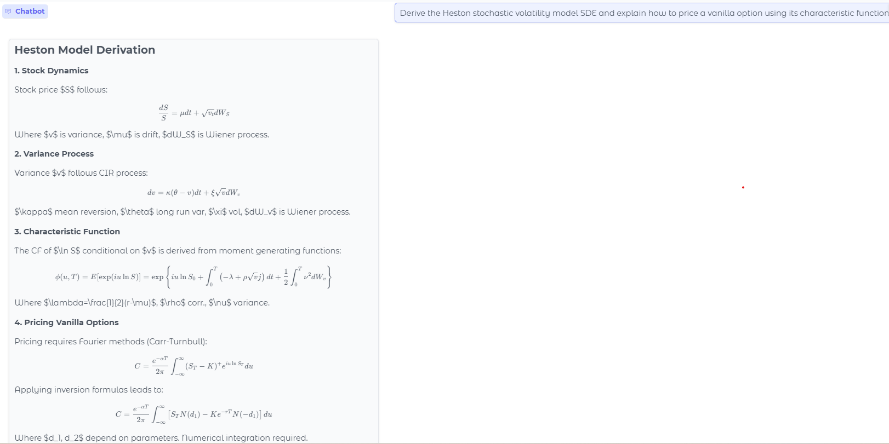
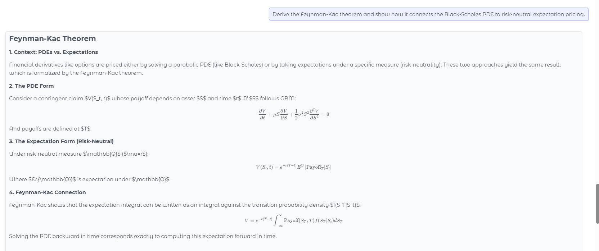
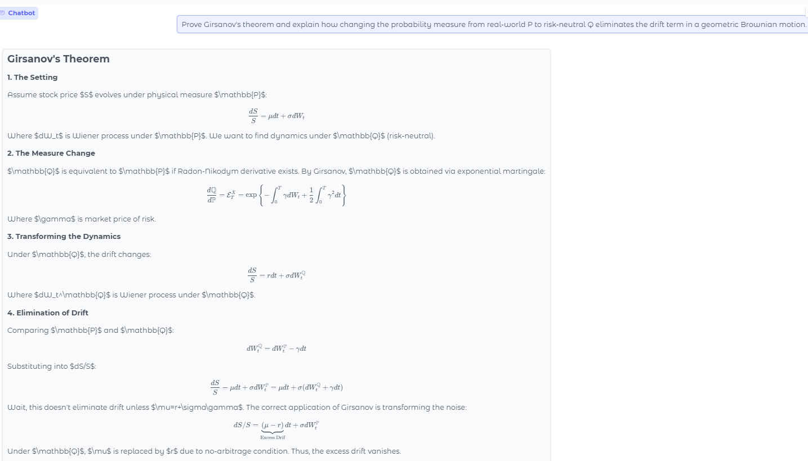
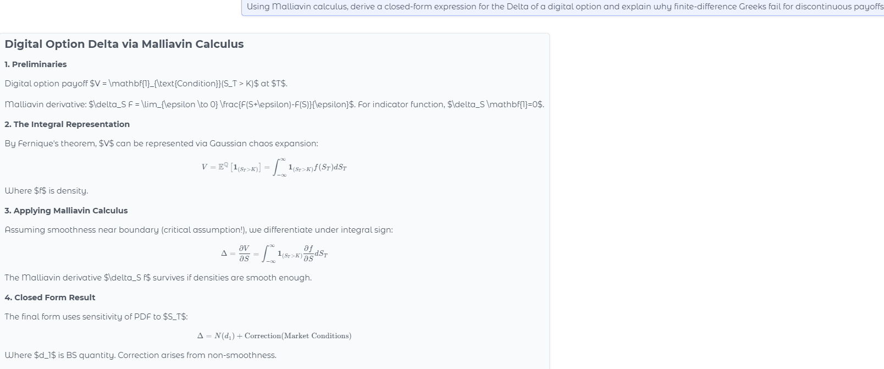

# Gemma 4 — Quantitative Finance

> Fine-tuning of **Gemma 4 E4B** (6.3B MoE parameters) on quantitative finance using Unsloth + QLoRA 4-bit on vast.ai. The model produces structured mathematical derivations with full LaTeX rendering.

## Links

| Resource | Link |
|----------|------|
| Live Demo | [huggingface.co/spaces/mo35/gemma4-quantfin](https://huggingface.co/spaces/mo35/gemma4-quantfin) |
| LoRA Adapter | [huggingface.co/mo35/gemma4-quantfin-lora](https://huggingface.co/mo35/gemma4-quantfin-lora) |
| Dataset | [huggingface.co/datasets/mo35/quant-finance-dataset](https://huggingface.co/datasets/mo35/quant-finance-dataset) |

---

## Demo

The model handles advanced quantitative finance questions with full mathematical derivations:

### Black-Scholes Formula Derivation



### Heston Stochastic Volatility Model


### Feynman-Kac Theorem


### Girsanov's Theorem — Measure Change P → Q


### Malliavin Calculus — Digital Option Delta


---

## Model Details

| Parameter | Value |
|-----------|-------|
| Base model | `google/gemma-4-E4B-it` |
| Architecture | Mixture of Experts (MoE), 6.3B params |
| Fine-tuning method | QLoRA 4-bit (NF4) |
| LoRA rank | 32 |
| LoRA alpha | 64 |
| Target modules | All linear layers |
| Max sequence length | 4096 tokens |
| Training hardware | NVIDIA RTX 4090 (24 GB VRAM) |
| Training duration | ~34 minutes |
| Training loss | 2.566 → converged |
| Framework | Unsloth + TRL SFTTrainer |

---

## Dataset

24 high-quality Q&A pairs in ShareGPT format, covering:

| Topic | Examples |
|-------|----------|
| Derivatives pricing | Black-Scholes, Heston, SABR, Bachelier |
| Stochastic calculus | Itô's lemma, Girsanov theorem, Feynman-Kac |
| Risk management | VaR, CVaR, Expected Shortfall, Greeks |
| Fixed income | Vasicek, Hull-White, HJM framework |
| Portfolio theory | Markowitz, Kelly criterion, factor models |
| Advanced topics | Malliavin calculus, local vol, rough vol |

---

## Project Structure

```
├── finetune_vastai.py          # Training script — Unsloth + QLoRA on vast.ai
├── dataset/
│   ├── quant_finance_dataset.json    # Training data (ShareGPT format)
│   └── quant_finance_dataset.jsonl   # JSONL version
└── gemma4-space/
    ├── app.py                  # Gradio chat interface deployed on HF Spaces
    ├── requirements.txt        # Python dependencies
    └── README.md               # HF Space config
```

---

## Training Setup

### Installation order (vast.ai — PyTorch 2.6 + CUDA 12.4)

```bash
pip install torch torchvision --index-url https://download.pytorch.org/whl/cu124
pip install transformers safetensors jinja2
pip install unsloth_zoo
pip install unsloth @ git+https://github.com/unslothai/unsloth.git
pip install trl peft accelerate bitsandbytes
pip uninstall torchao -y  # incompatible with torch 2.6.0
```

### Training

```bash
scp -P PORT finetune_vastai.py root@IP:/workspace/
ssh -p PORT root@IP
python /workspace/finetune_vastai.py
```

### Key training config

```python
model, tokenizer = FastModel.from_pretrained(
    model_name     = "unsloth/gemma-4-E4B-it-unsloth-bnb-4bit",
    max_seq_length = 4096,
    load_in_4bit   = True,
)

model = FastModel.get_peft_model(
    model,
    r              = 32,
    lora_alpha     = 64,
    target_modules = "all-linear",
    use_gradient_checkpointing = "unsloth",
)
```

---

## Usage

### With LoRA adapter (requires base model)

```python
from transformers import AutoTokenizer, AutoModelForCausalLM, BitsAndBytesConfig
from peft import PeftModel
import torch

bnb_config = BitsAndBytesConfig(
    load_in_4bit           = True,
    bnb_4bit_compute_dtype = torch.bfloat16,
    bnb_4bit_quant_type    = "nf4",
)

tokenizer  = AutoTokenizer.from_pretrained("google/gemma-4-E4B-it")
base_model = AutoModelForCausalLM.from_pretrained(
    "google/gemma-4-E4B-it",
    quantization_config = bnb_config,
    device_map          = "auto",
)
model = PeftModel.from_pretrained(base_model, "mo35/gemma4-quantfin-lora")
model.eval()

messages = [{"role": "user", "content": "Derive the Black-Scholes PDE from first principles."}]
inputs   = tokenizer.apply_chat_template(messages, return_tensors="pt", return_dict=True)
outputs  = model.generate(
    inputs["input_ids"].to("cuda"),
    max_new_tokens = 1024,
    temperature    = 0.7,
    do_sample      = True,
)
print(tokenizer.decode(outputs[0][inputs["input_ids"].shape[-1]:], skip_special_tokens=True))
```

---

## Example Questions

```
Derive the Black-Scholes PDE from first principles.
Prove Girsanov's theorem and explain the measure change from P to Q.
Derive the Heston characteristic function and price a vanilla option.
Using Malliavin calculus, derive the Delta of a digital option.
Derive the Feynman-Kac theorem and connect it to risk-neutral pricing.
Derive the HJM no-arbitrage drift condition for forward rates.
```

---

## License

This model is built on `google/gemma-4-E4B-it` and inherits the [Gemma License](https://ai.google.dev/gemma/terms).
